# Erlang/OTP

---
# Temario
* Primera aplicación
* Grandes Conceptos
* Erlang
* OTP
* Comparación con otros sistemas
* Chelas

---
# Disclaimer
Este curso es gratuito y disponible “AS IS”. Sin ningún compromiso por parte del expositor o de la empresa que representa. Cualquier daño psicológico, decepción, o fallecimiento producido por la revisión de este material no podrá ser atribuido al expositor.

---
# Primera Aplciación


---
# Advertencia

A continuación alto contenido de historia, teoría, rants, violencia, preguntas incómodas, drogas, sentimientos lastimados y terapia grupal.

* Pónganse cómodos
* Saquen las palomitas
* Favor de no roncar

---
# Tres grandes conceptos

---
# ...o Buzzwords

---

## Alta disponibilidad
## Tolerancia a Fallos
## Escalabilidad

---
# Alta Disponibilidad 

---
# ¿Qué es Alta Disponibilidad? 

##Cualidad o condición de algo que indica que puede ser encontrado o usado  

---
# Principios

1. Elimination of single points of failure.
2. Reliable crossover.
3. Detection of failures as they occur.

---
# Alta disponibilidad requiere de redundancia

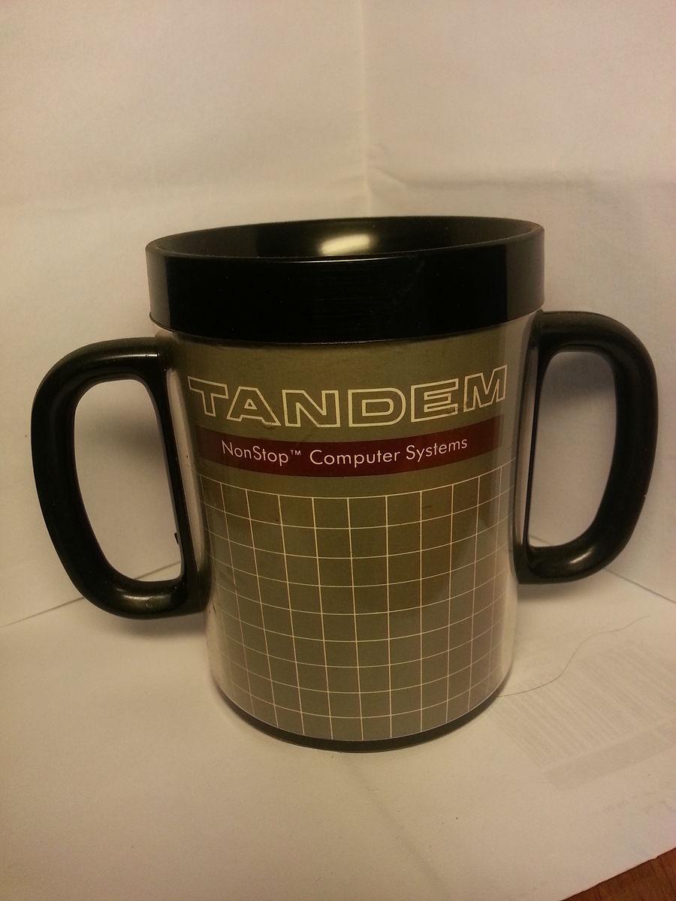

--- 
# Tandem

La compañia fue fundada en 1974 y permanecio independiente hasta 1997. Ahora es una división dentro de Hewlett Packard.

--- 
# Tandem

*Tandem's NonStop systems use a number of independent identical processors and redundant storage devices and controllers to provide automatic high-speed "failover" in the case of a hardware or software failure...
... NonStop processors cooperate by exchanging messages across a reliable fabric, and software takes periodic snapshots for possible rollback of program memory state.*

---
# Tandem

*To contain the scope of failures and of corrupted data, these multi-computer systems have no shared central components, not even main memory.*

---
# shared-nothing

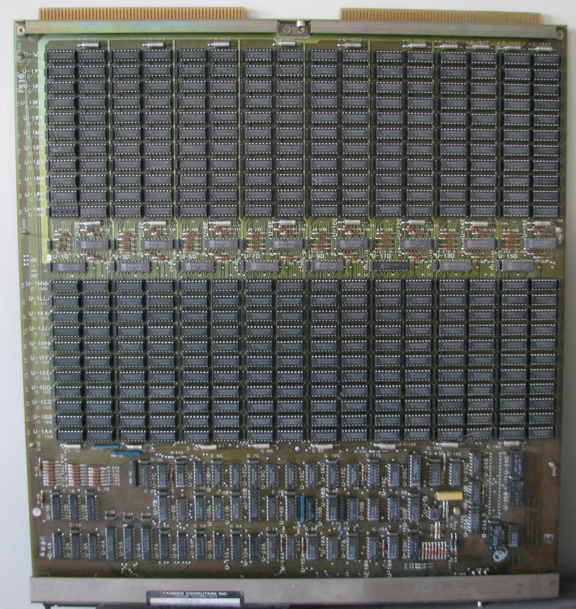

---
# Tolerancia a fallos

---
# Para tener tolerancía a fallos el sistema debe estar construido de componentes aislados

---
# Si los componentes están aislados pueden correr concurrentemente

---
# ¡Si los componentes están aislados y pueden correr de forma concurrente nuestro sistema es escalable!

---
# Al no tener una Tandem...

---
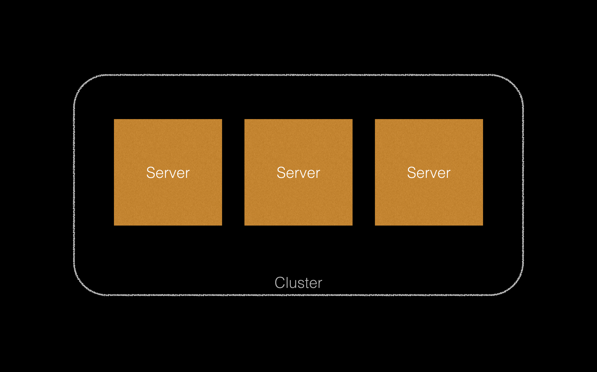

---
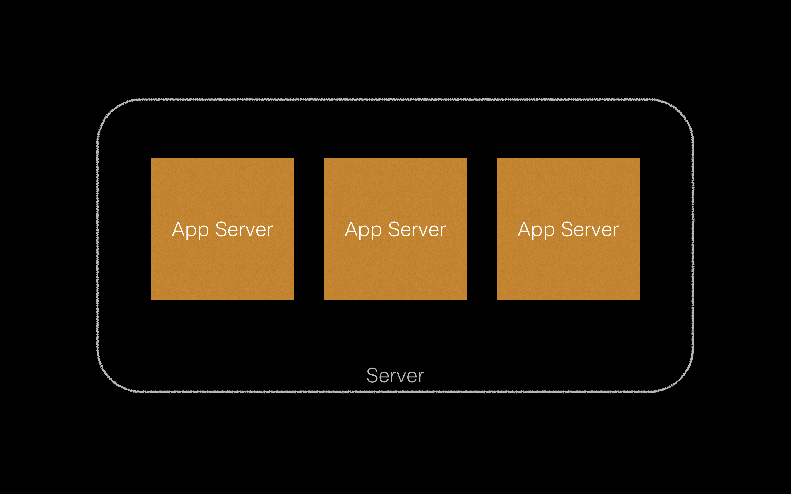

---
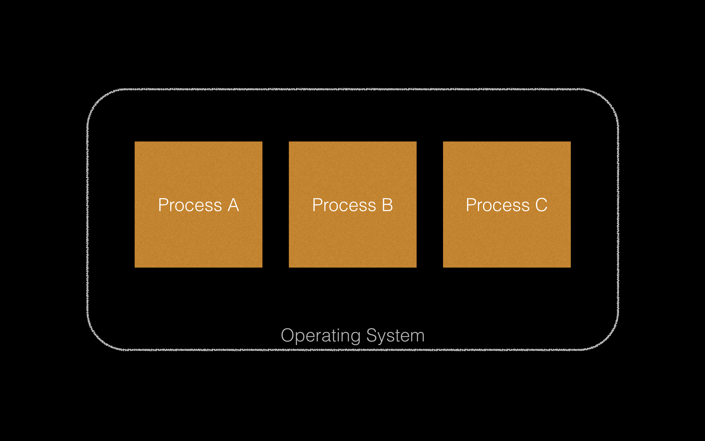

---
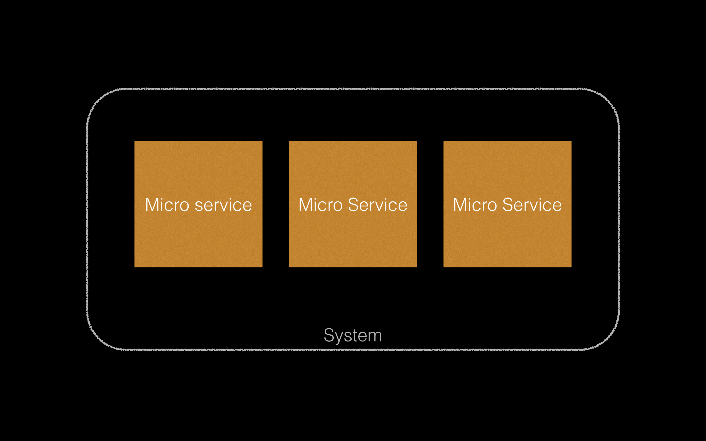

---
# ¿Por qué no seguir haciendolo así?

* Costo de infraestructura
* Complejidad de desarrollo
* Complejidad de despliegue

---
# ¡Hay otras formas de resolver el problema!

---
# Corria el año de 1972...

---

> "OOP to me means only **messaging**, local retention and protection and
**hiding of state-process**, and extreme late-binding of all things."
-- Alan Kay on the Meaning of “Object-Oriented Programming”

---
# ¿Qué otras bases teoricas tenemos?

---
# Modelo de Actores por Carl Hewitt en 1973

---
# Communicating Sequential Processes (CSP) por Tony Hoare en 1978

---
# ¿Qué es Erlang?

*Erlang is a programming language used to build massively scalable soft real-time systems with requirements on high availability...*

*...Erlang's runtime system has built-in support for concurrency, distribution and fault tolerance.*

---
# ¿Qué es OTP?

*OTP is set of Erlang libraries and design principles providing middle-ware to develop these systems. It includes its own distributed database, applications to interface towards other languages, debugging and release handling tools.*

---
# ¿Cómo lo hace?

---
# Tiene procesos ligeros

---
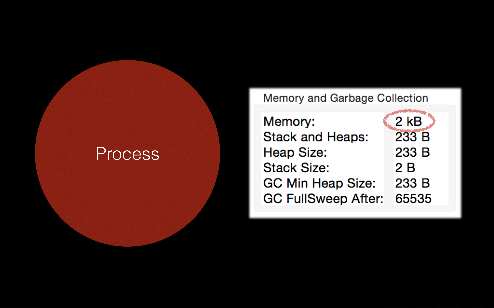

---
# Comparación con otras estructuras
## Proceso del sistema operativo 4MB
## Thread de sistema operativo 1MB
## Goroutine 4k

---
# Tiene envio de mensajes

---


---
# Tiene actualización de código en vivo

---


---
# ¡Erlang es un sistema operativo!

---
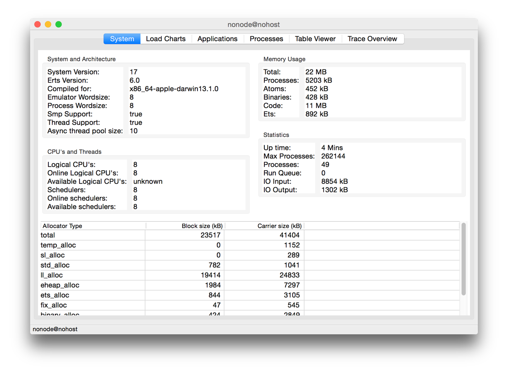

---
# Bogdan/Björn's Erlang Abstract Machine (BEAM)

---
# Elementos
* Ports y NIFs
* Schedulers
* Garbage Collector
* SMP

---
# Memoria
* Process heaps
* ETS tables
* Atom table
* Large binary space

---
# Historia de Erlang

---
## Maquina virtual y lenguaje desarrollado en Ericsson por Joe Armstrong, Robert Virding y Mike Williams en 1985 

---
## Primer sistema productivo: Switch AXD301
## 1 Millón de lineas de código y disponibilidad de nueve nueves (31.5569 ms/año)

---
## Liberado como open source en 1998

---
## En 2006 se le agrega soporte para symmetric multiprocessing (SMP)

---
## Erlang: The movie

---


---
# Principios de la plataforma

---

## Share nothing
## Failure handling
## Fail fast

---
# ¿Qué pasa cuando se presenta un error no previsto?

---
# Flujo
1. El proceso termina
2. El proceso reporta la razón a otro proceso
3. El otro proceso recibe la señal y toma alguna acción

---
# ¿Cómo hacemos eso?

---
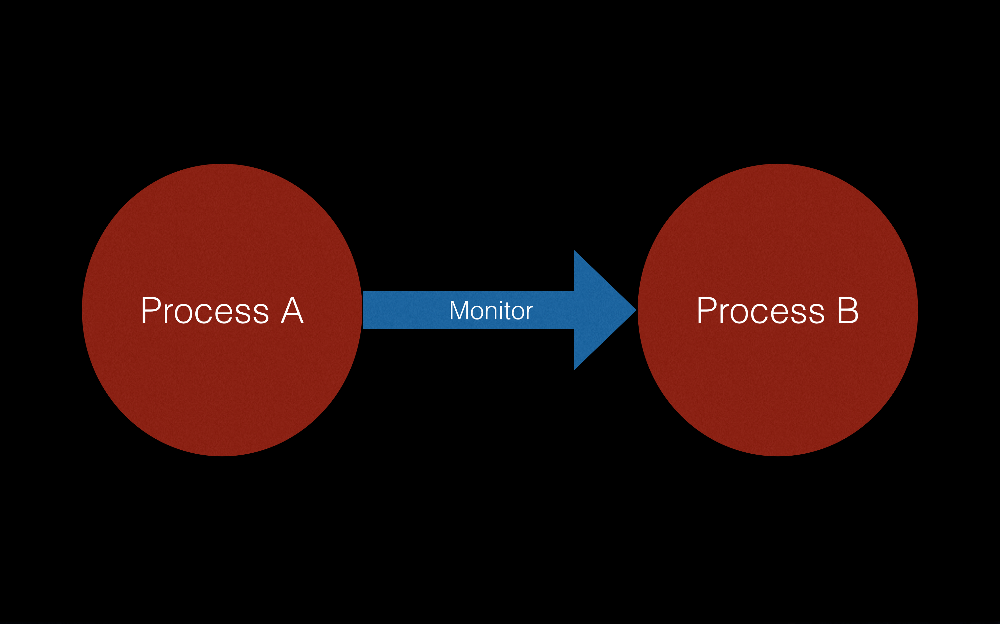

---
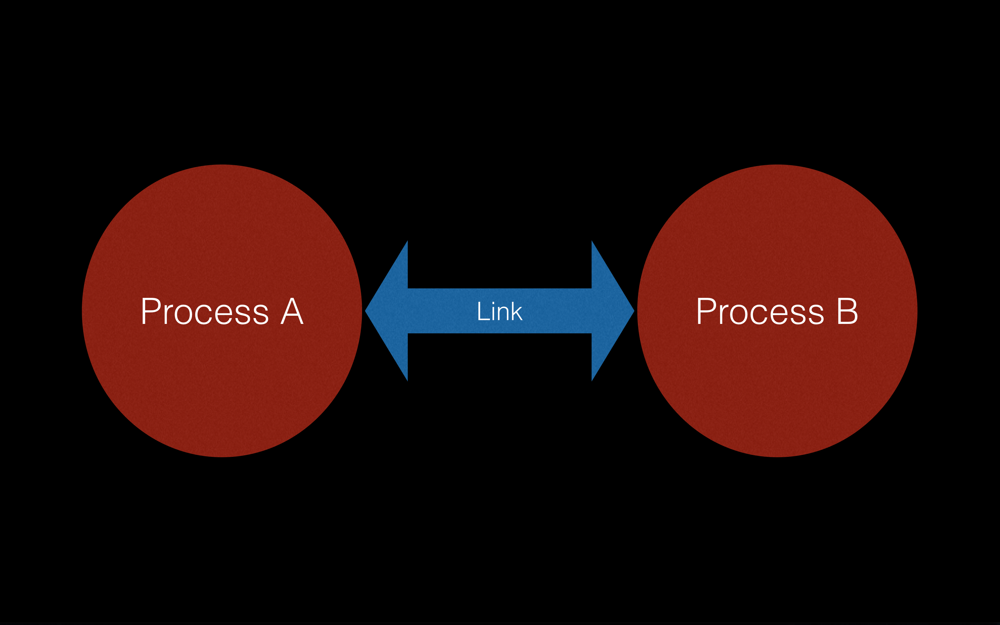

---
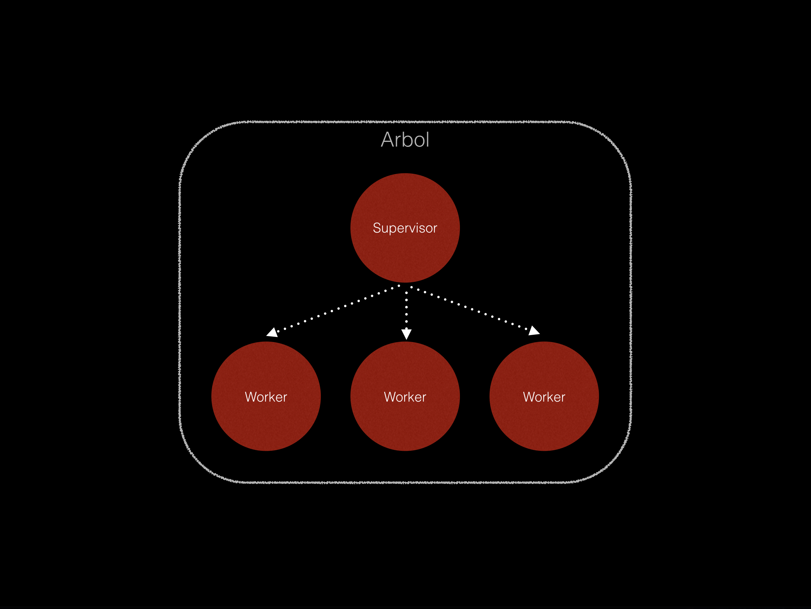

---
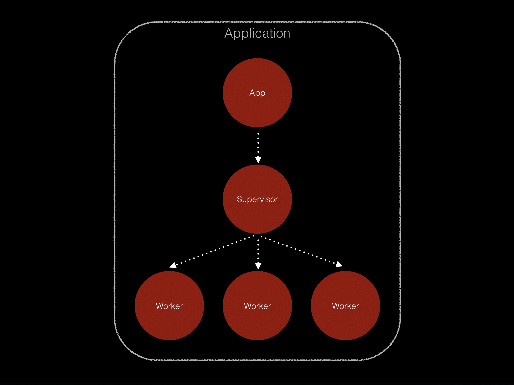

---
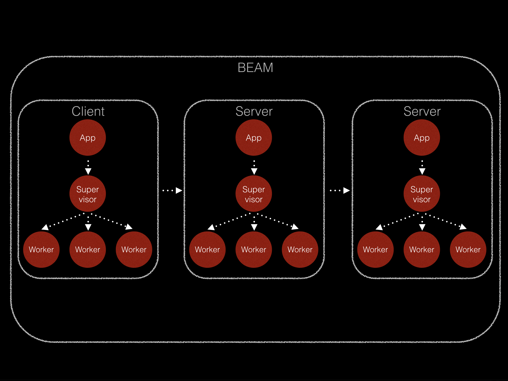

---
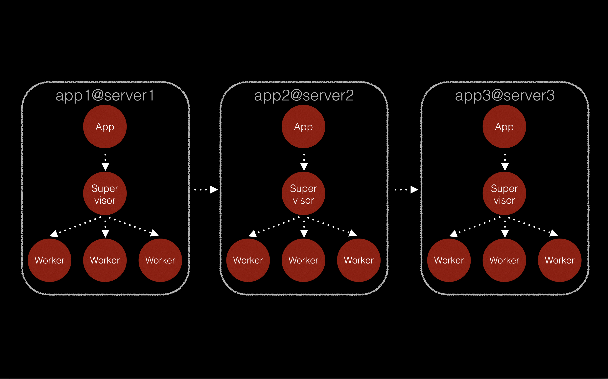

---
# Limite por defecto es de 262,144 procesos

---


---
# Open Telecom Platform (OTP)

---
# Topologías
* Agent
* GenServer
* GenEvent
* Supervisor
* Application
* Task

---
# Agents

##Simple wrappers around state

---
``` elixir
defmodule KV.Bucket do
  @doc """
  Starts a new bucket.
  """
  def start_link do
    Agent.start_link(fn -> HashDict.new end)
  end

  @doc """
  Gets a value from the `bucket` by `key`.
  """
  def get(bucket, key) do
    Agent.get(bucket, &HashDict.get(&1, key))
  end

  @doc """
  Puts the `value` for the given `key` in the `bucket`.
  """
  def put(bucket, key, value) do
    Agent.update(bucket, &HashDict.put(&1, key, value))
  end
end
```

---
# GenServer

## "Generic servers" (processes) that encapsulate state, provide sync and async calls, support code reloading, and more

---
```elixir
defmodule KV.Registry do
  use GenServer

  ## Client API
  def start_link(opts \\ []) do
    GenServer.start_link(__MODULE__, :ok, opts)
  end

  def lookup(server, name) do
    GenServer.call(server, {:lookup, name})
  end

  def create(server, name) do
    GenServer.cast(server, {:create, name})
  end

  ## Server Callbacks
  def init(:ok) do
    {:ok, HashDict.new}
  end

  def handle_call({:lookup, name}, _from, names) do
    {:reply, HashDict.fetch(names, name), names}
  end

  def handle_cast({:create, name}, names) do
    if HashDict.has_key?(names, name) do
      {:noreply, names}
    else
      {:ok, bucket} = KV.Bucket.start_link()
      {:noreply, HashDict.put(names, name, bucket)}
    end
  end
end
```

---
# GenEvent

## "Generic event" managers that allow publishing events to multiple handlers

---
```elixir
defmodule Forwarder do
  use GenEvent

  def handle_event(event, parent) do
    send parent, event
    {:ok, parent}
  end
end

{:ok, manager} = GenEvent.start_link
GenEvent.add_handler(manager, Forwarder, self())
GenEvent.sync_notify(manager, {:hello, :world})
```

---
# Supervisor

## Processes that monitor other processes 

---
```elixir
defmodule KV.Supervisor do
  use Supervisor

  def start_link do
    Supervisor.start_link(__MODULE__, :ok)
  end

  @manager_name KV.EventManager
  @registry_name KV.Registry

  def init(:ok) do
    children = [
      worker(GenEvent, [[name: @manager_name]]),
      worker(KV.Registry, [@manager_name, [name: @registry_name]])
    ]

    supervise(children, strategy: :one_for_one)
  end
end

```

---
# Estrategias

* one\_for_one: if a child process terminates, only that process is restarted.
* one\_for_all: if a child process terminates, all other child processes are terminated and then all child processes are restarted.
* rest\_for_one: if a child process terminates, the “rest” of the child processes are terminated. Then those processes are restarted.
* simple\_one_for_one: similar to :one\_for_one but you dynamically attach children. This strategy requires the supervisor specification to contain only one child.

---
# Applications

## Applications are the entities that are started and stopped as a whole by the runtime. 

---
```elixir
def application do
  [applications: [],
   mod: {KV, []}]
end

Application.start(:kv)

```

---
# Task

## Asynchronous units of computation that allow spawning a process and easily retrieving its result at a later time

---
```elixir
task = Task.async(fn -> do_some_work() end)
res  = do_some_other_work()
res + Task.await(task)
```

---
# Erlang como plataforma
* VM
* Lenguaje
* HiPE
* Dialyzer
* OTP
* ETS
* Mnesia

---
# ¿Y Go Apa?

---
```Go
func TransformFile(fileName string, receipt *yaml.Yaml) (fileData *[]byte, merr *model.MercurioError) {
  defer func() {
    if r := recover(); r != nil {
      l4g.Critical("Recovered ", r)
      merr = &model.MercurioError {
        StageName : "Transform",
        ErrorType : "Fatal",
        FileName  : fileName,
        Message   : "Error reading file",
      }
      fileData = nil
    }
  }()

...
}
```

---
# ¿Y Node.js Apa?

---
# Mejor vamonos a tomar unas chelas...

---
# Referencias
[Building Highly Available Systems in Erlang](http://www.infoq.com/presentations/Building-Highly-Available-Systems-in-Erlang)
[Self Heal Scalable System](http://www.infoq.com/presentations/self-heal-scalable-system)
[Fault Tolerance 101 Qcon London](http://www.infoq.com/presentations/fault-tolerance-101-qcon-london)
[NDC London 2014: Thinking Like an Erlanger](http://www.slideshare.net/torbenhoffmann90/2014-12ndcthinking)
[The Mess We're In](https://www.youtube.com/watch?v=lKXe3HUG2l4) 

---
## Libros
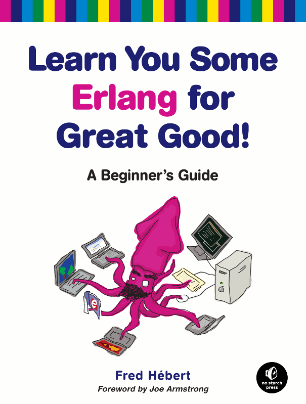 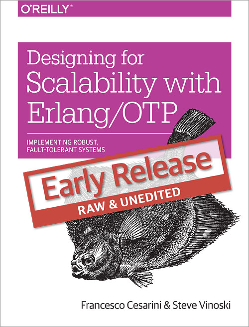 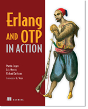 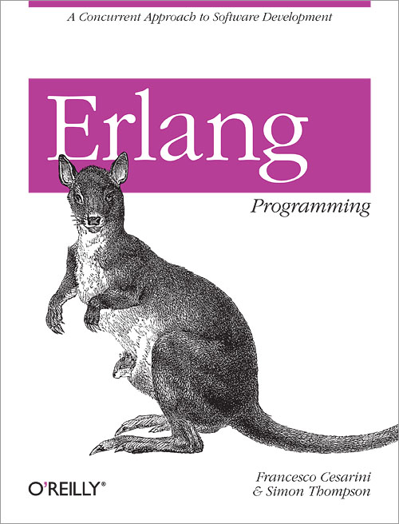 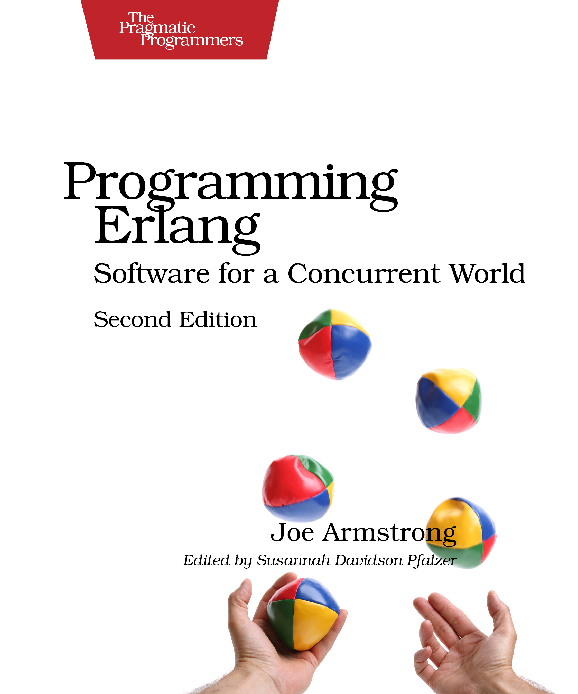

---

