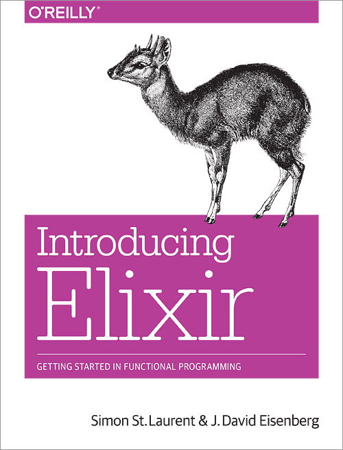

# Elixir

---
# Temario
* Historia
* Características Especiales
* Lenguaje
* OTP
* Revisión de un proyecto real

---
# Historia
* Desarrollado por José Valim
* Primera versión Enero de 2011
* Nueva versión compatible con Erlang Agosto de 2012
* Erlang App support Diciembre de 2012
* Versión 1.0 septiembre de 2014
* Versión actual 1.0.2

---
# Caracteristicas - 1
* Corre en la BEAM
* Dinámico
* Funcional
* Polimorfismo (Protocols: Clojure, Type classes: Haskell, Interfaces: Go)
* Unicode (UTF-8)
* Todo es una expresión

---
# Caracteristicas - 2

* Sistema de macros higíenico
* Pattern matching
* Zero-index access
* Keyword arguments
* Expresiones regulares
* Inmutable

---
# A distributed programming language

---
# A good getting-started experience

---
# Almost everything in the language is implemented in Elixir itself and often with macros

---
# Ejemplo 

```elixir
defmodule Hello do
  IO.puts "Defining the function world"

  def world do
    IO.puts "Hello World"
  end

  IO.puts "Function world defined"
end

Hello.world
```

---
# Objetivos
* Compatibilidad
* Extensibilidad
* Productividad

---
# Compatibilidad con Erlang

```erlang
iex> :crypto.md5("Using crypto from Erlang OTP")
<<192,223,75,115,...>>
```

---
# Extensibilidad
> "Now we need to go meta. We should now think of a language design as being a pattern for language designs. 
A tool for making more tools of the same kind."
-- Guy Steele - "Growing a language" at ACM OOPSLA 1998

---
# Macros

```elixir
defmacro unless(expr, opts) do
  quote do
    if(!unquote(expr), unquote(opts))
  end
end

unless(is_number(x), do: raise("oops"))
```

---
# DSL para pruebas

```elixir
defmodule MathTest do
  use ExUnit.Case

  test "basic operations" do
    assert 1 + 1 == 2
  end
end
```

---
# DSL para consultas

```elixir
from p in Post,
where: p.published_at < now and
       p.author == "José",
order: p.created_at
```

---
# Productividad

* Documentación (Markdown) -> *Python*
* Herramientas (ExUnit, IEx, Mix) -> *Go*
* Paquetes (Hex) -> *Ruby*

---
# Lenguaje

Usaremos el libro Elixir in Action

* Capitulo  2
* Capitulos 3
* Capitulo  4 
* Capitulo  5
* Capitulo  6

---
# Veamos un proyecto
[Payment Processing System](https://github.com/joshnuss/commerce_billing)

---
# Referencias

[Elixir Official Site](http://http://elixir-lang.org)
[Getting Started](http://elixir-lang.org/getting_started/1.html) 
[Erlang Factory Berlin 2014](http://www.erlang-factory.com/berlin2014)
[Fault Tolerance 101 Qcon London](http://www.infoq.com/presentations/fault-tolerance-101-qcon-london)
[NDC London 2014: Thinking Like an Erlanger](http://www.slideshare.net/torbenhoffmann90/2014-12ndcthinking)
[The Mess We're In](https://www.youtube.com/watch?v=lKXe3HUG2l4) 
[The Mess We're In](https://github.com/h4cc/awesome-elixir)

---
## Libros
   

---


