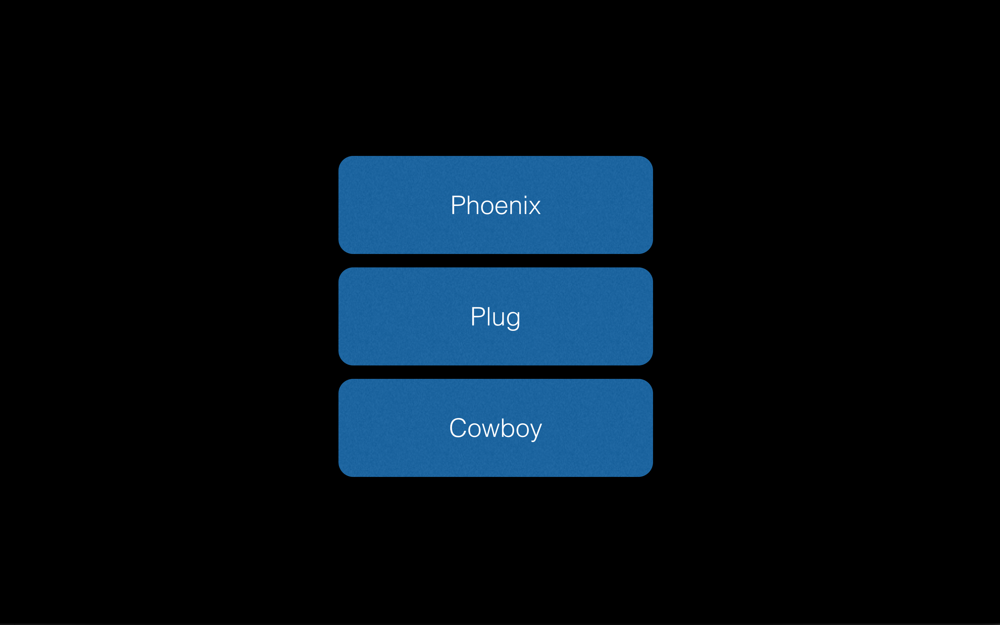
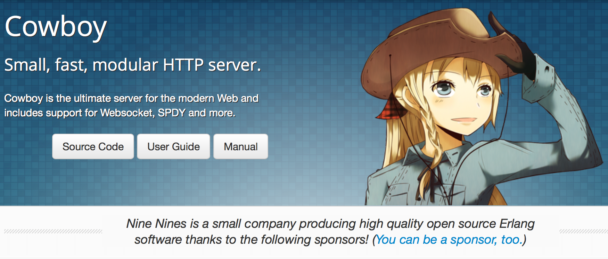
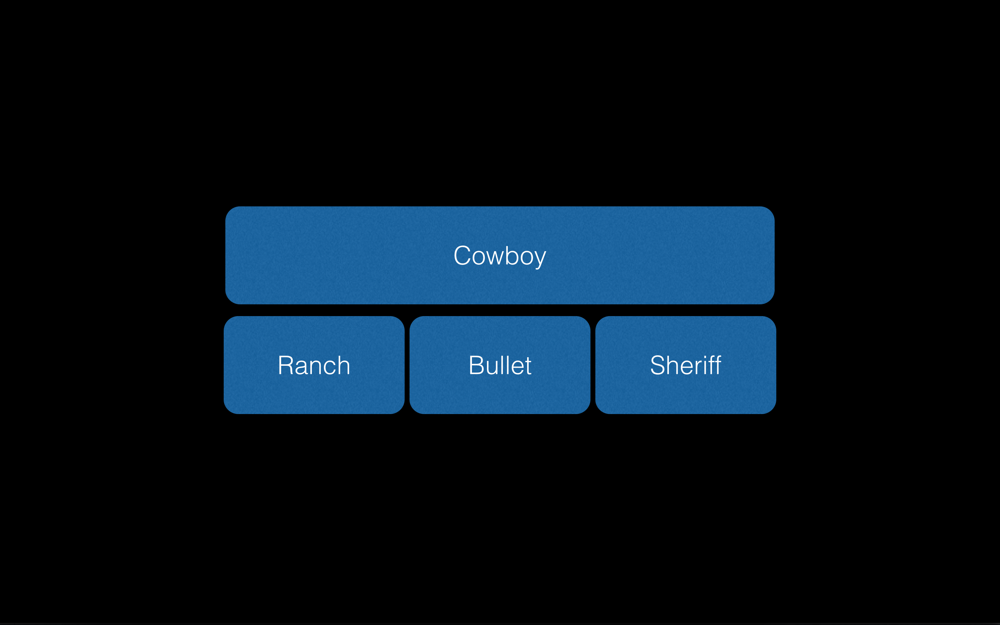
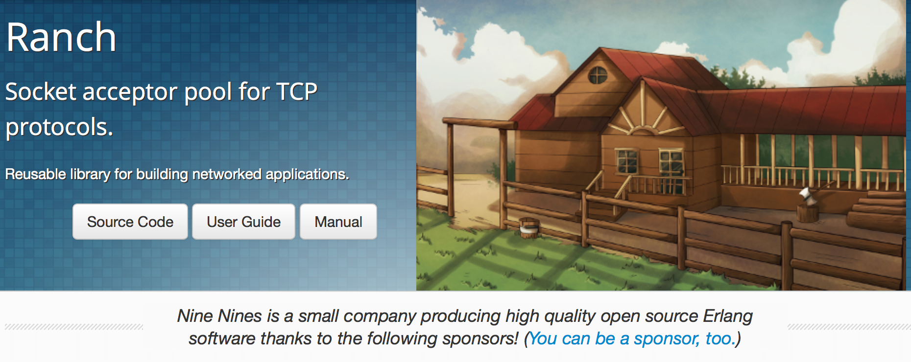
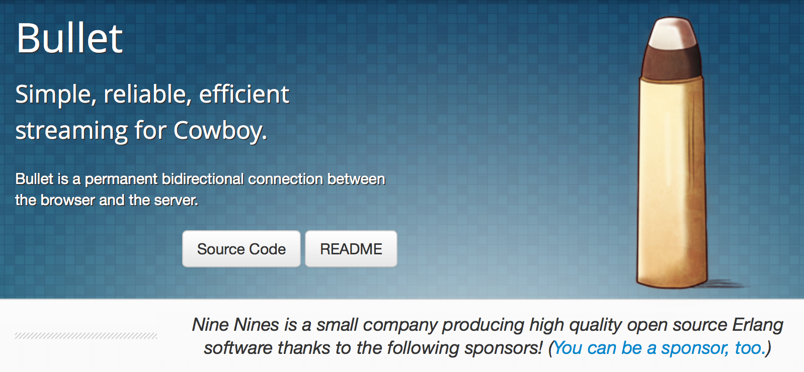
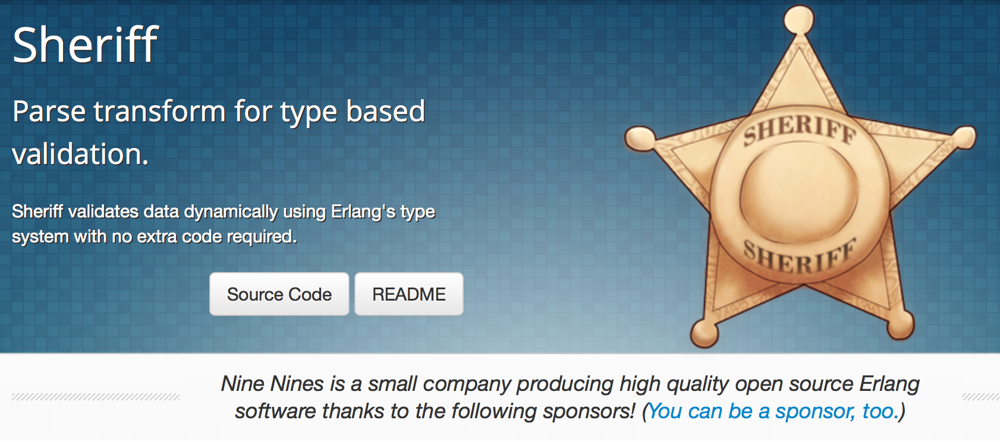

# Phoenix Framework

---
# Temario

1. Historia
2. Arquitectura
3. Módulos

---
# Historia

* Phoenix inicio en enero de 2013
* Creado por Chris MCCord
* Apoyado por José Valim desde septiembre

---
# Arquitectura

---


---
# ¿Cómo manejar las conexiones?
* Serial
* Proceso por conexión
* Thread por conexión
* Preforking
* Thread pool
* Evented
* Hibridos

---
# Serial
Ventajas
* Simple
* Bajo consumo de recursos

Desventajas
* No concurrencia
* No puede atender otras peticiones en idle 

---
# Proceso por conexión
Ventajas
* Simple
* Seguridad
* Tolerancia a Fallos

Desventajas
* Consumo de memoria
* Tiempo de creación

Ejemplo
* inetd

---
# Thread por conexión
Ventajas
* Relativamente simple
* Consume menos recursos

Desventajas
* No aislamiento
* Cambio de contexto

Ejemplo
* Mongrel

---
# Preforking
Ventajas
* Control de limite de recursos
* No costo de creación
* Simple

Desventajas
* Mas consumo de memoria

Ejemplo
* Unicorn

---
# Thread pool
Ventajas
* Similares a la de preforking

Desventajas
* Manejo de errores

Ejemplo
* Puma

---
# Evented
Ventajas
* Sólo un Proceso y thread
* El mejor para manejar muchas conexiones concurrentes

Desventajas
* Modelo de programación (Callbacks)
* Manejo de fallos

Ejemplos
* Evented Machine
* Celluloid::IO
* Node.js

---
# Hibridos
Nginx (1 millon connections on single server)
* Preforking
* Evented

Apache
* Preforking (workers)
* Thread pool

Puma
* Thread pool
* Evented

---
# ¿Cuanta memoria para manejar 1 Millon de conexiones?

* Procesos: 4 terabytes
* Theads:   1 terabyte
* Erlang:   2 gigabytes

---
# Whatsapp
* 2 Millones de conexiones 
* Intel Xeoan CPU X5675@3.07Ghz
* 24 CPUs
* 96GB RAM
* Uso del 40% de CPU y memoria

---



---



---



---



---



---
# Plug

---
# ¿Qué es?

1. *A specification for composable modules in between web applications*
2. *Connection adapters for different web servers in the Erlang VM*

* Similar a Rack para Ruby o Ring de clojure

---
# Pipelines
```elixir
defmodule MyApp.Router do
  use Phoenix.Router

  pipeline :browser do
    plug :accepts, ~w(html)
    plug :fetch_session
  end

  pipeline :api do
    plug :accepts, ~w(json)
  end

  scope "/", alias: MyApp do
    pipe_through :browser

    get "/pages/:page", PageController, :show
  end

  scope "/api", alias: MyApp.Api do
    pipe_through :api

    resources "/users", UserController
  end
end
```

---
# Cada plug puede responder y terminar el flujo

---
# Modulos

---

## Router
## Controllers
## Views
## Templates
## Channels

---
# Router

Usa Pattern Matching de la BEAM
Extremadamente optimizado y eficiente 

---
# Controllers

---
# Views

---
# Templates

---
# Channels

---
# Referencias
[Phoenix Official Site](http://www.phoenixframework.org)
[99s](http://ninenines.eu)

---


